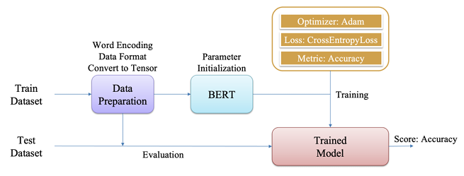
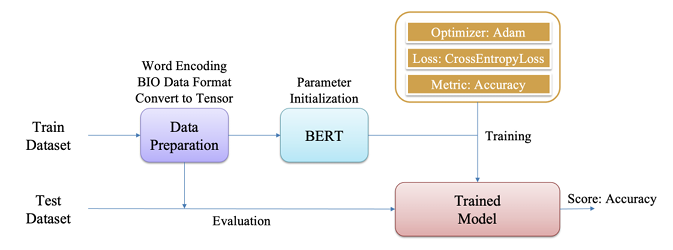

# 🌟 POS Tagging & Medical NER: Unlocking the Power of Medical Text Analysis 🌟

---

## 🚀 Project Vision
Welcome to the **POS Tagging & Medical NER** project, where we dive deep into the world of natural language processing to unlock insights from medical texts! This project combines **Part-of-Speech (POS) Tagging** with **Medical Named Entity Recognition (NER)** to tag grammatical structures and extract critical medical entities like diseases, medications, and treatments with precision. Built for the medical domain, it’s designed to empower researchers, clinicians, and data scientists with cutting-edge NLP tools.

---

## 🎯 What Makes This Project Shine?
- **POS Tagging Magic**: Effortlessly labels words with their grammatical roles (nouns, verbs, adjectives, and more) to reveal the syntactic structure of sentences.
- **Medical NER Superpower**: Pinpoints and categorizes medical entities—think drugs, symptoms, and diagnoses—in complex, unstructured texts.
- **Domain-Specific Expertise**: Fine-tuned for medical corpora, ensuring high accuracy in specialized contexts.
- **Interactive Training Insights**: Powered by **TensorBoard** for real-time visualization of training progress and model performance.
- **Robust Evaluation**: Comprehensive metrics to showcase the model’s prowess (more on this below!).

---

## 📂 Project Blueprint
Here’s the dazzling structure of our project, carefully crafted to keep everything organized and magical:

```
POS-Tagging-and-Medical-NER/
├── 📁 medical_ner/                # Core of Medical NER operations
│   ├── 🛠️ __init__.py            
│   ├── 🔍 inference.py            # Scripts for running NER predictions
│   ├── 📚 medical_ner_dataset.py  # Dataset preparation for Medical NER
│   ├── ⚙️ preprocess_macroat.py   # Preprocessing scripts for NER data
│   └── 🚀 train.py                # Training scripts for the NER model
├── 📁 pos_tagging/                # Heart of POS Tagging operations
│   ├── 🛠️ __init__.py            
│   ├── 🔍 inference.py            # Scripts for running POS predictions
│   ├── 📚 pos_tagging_dataset.py  # Dataset preparation for POS Tagging
│   ├── ⚙️ pos_tagging_preprocess.py  # Preprocessing scripts for POS data
│   └── 🚀 train.py                # Training scripts for the POS model
├── 📁 util/                       # Utility tools to make everything smoother
│   ├── 🛠️ __init__.py            
│   └── 📊 metric.py               # Scripts for calculating evaluation metrics
├── 📜 README.md                   # Your guide to this dazzling project
└── 📋 requirements.txt            # All the dependencies to bring this to life
```

---

## 🧠 Training and Evaluating Progress



<p align="center"><em>POS Tagging Progress</em></p>

<br><br>



<p align="center"><em>Medical NER Progress</em></p>

---

## ⚙️ Getting Started
## ✨ Inference: Bringing Predictions to Life
Ready to see the model in action? Run inference on your medical texts using the provided scripts:
```bash
python medical_ner/inference.py --input "Patient reports fever and shortness of breath"
```
Or for POS Tagging:
```bash
python pos_tagging/inference.py --input "Patient reports fever and shortness of breath"
```
Watch as the model tags parts of speech or highlights medical entities with surgical precision!

---

## 📊 Evaluation: Where Results Shine Bright
  

---
